<h1 align="center">QuickClipboard</h1>

<p align="center">
  <strong>복사 및 붙여넣기 경험을 재정의하다</strong><br>
  가벼움 · 빠름 · 스마트함 · 맞춤 설정 가능
</p>

<div align="center">
  
  <br><br>
  <a href="https://github.com/mosheng1/QuickClipboard/stargazers">
    
  </a>
  <a href="https://github.com/mosheng1/QuickClipboard/releases">
    
  </a>
  <a href="https://github.com/mosheng1/QuickClipboard/releases">
    
  </a>
  <a href="https://github.com/mosheng1/QuickClipboard/blob/main/LICENSE">
    
  </a>
</div>

<div align="center">
  <a href="../README.md">简体中文</a> · <a href="README.en.md">English</a> · <a href="README.zh-TW.md">繁體中文</a> · <a href="README.ja.md">日本語</a> · <b>한국어</b>
</div>

---

## 소개

**QuickClipboard**는 Tauri 2 + Rust + React로 구축된 크로스 플랫폼 클립보드 강화 도구입니다 (현재 Windows 및 Android 지원). 복사하는 순간 자동으로 텍스트, 이미지, 리치 텍스트, 파일을 기록하여 이전에 복사한 모든 내용을 언제든지 찾아볼 수 있습니다. 기록뿐만 아니라 스크린샷, 이미지 고정, OCR, WebDAV 동기화, LAN 동기화/전송 등 다양한 기능을 통합하여 일상 업무 생산성을 획기적으로 향상시킵니다.

> 네이티브 성능, 낮은 메모리 사용량, 실행 즉시 사용 가능, 시스템 트레이 상주.

---

## 핵심 기능

| 모듈                     | 기능                                                                                                                |
| ------------------------ | ------------------------------------------------------------------------------------------------------------------- |
| 클립보드 관리            | 전체 유형 기록 (텍스트 / HTML / 이미지 / 파일) · 스마트 중복 제거 · 검색 필터 · 가상 리스트 · 드래그 정렬 / 고정 · SQLite 영구 저장 |
| 콘텐츠 미리보기          | 호버 미리보기 (텍스트 / HTML / 이미지 / 파일 목록) · Ctrl+스크롤 / 확대축소 · 다중 형식 전환 미리보기                  |
| 빠른 붙여넣기            | 목록에서 붙여넣기 · 숫자 키 1-9로 붙여넣기 · 일반 텍스트 / 서식 유지 붙여넣기 · 병합 복사 / 병합 붙여넣기 · 원샷 붙여넣기 · 빠른 붙여넣기 창 · Win+V 지원 |
| 즐겨찾기 및 그룹         | 자주 사용하는 내용 즐겨찾기 · 사용자 정의 그룹 / 아이콘 / 색상 · 그룹 정렬 · 그룹으로 일괄 이동 · 단축키로 그룹 전환 |
| Emoji / 기호 / 갤러리    | 완전한 이모지 세트 · 기호 라이브러리 · 사용자 정의 이미지 / GIF 갤러리 · 최근 사용 · 드래그 또는 클릭으로 사용       |
| 화면에 고정              | 데스크탑 상단 고정 · GPU 가속 렌더링 · 드래그로 크기 조절 / 고정 · 복사 / 다른 이름으로 저장 · 스크린샷 후 바로 고정 |
| 내장 스크린샷            | 일반 스크린샷 · 빠른 스크린샷 / 빠른 고정 / 빠른 OCR · 다중 모니터 지원 · 스크롤 스크린샷 · 자동 영역 감지 · 화면 색상 추출 · 주석 편집 |
| OCR 인식                 | 이미지 OCR · 스크린샷 OCR · 원클릭 텍스트 추출 및 복사                                                                 |
| 동기화 / 전송            | WebDAV 전체 동기화 · LAN HTTP 직접 연결 · 페어링 코드 연결 · 자동 푸시/풀 · 파일 전송                                  |
| 가장자리 스냅 및 창      | 화면 가장자리에서 자동 숨김 · 커서 따라 호출 · 창 고정 · 위치 / 크기 기억 · 제목 표시줄 방향 전환                      |
| 개인화                   | 시스템 테마 따르기 / 라이트-다크 테마 / 슈퍼 배경 · 여러 테마 스타일 · 사용자 정의 배경 / 흐림 · 사용자 정의 글꼴 · 애니메이션 전환 |
| 저메모리 모드            | 자동 또는 수동으로 경량 모드 전환 · 즉시 전체 UI 복원 · 메모리 걱정 불필요 (저메모리 모드에서 약 10MB)                   |
| 백그라운드 최적화        | 백그라운드 진입 시 자동 메모리 정리 · 프론트엔드 업데이트 일시 중지 · 시스템 리소스 사용량 감소 (백그라운드에서 약 50MB)  |
| 데이터 관리              | ZIP 가져오기 / 내보내기 · 백업 및 복원 · 사용자 정의 저장 경로 · 데이터 마이그레이션 / 병합 · 기록 지우기 · 포터블 모드 |
| 앱 필터링                | 블랙리스트 / 화이트리스트 메커니즘 · 클립보드 모니터링만 필터링 · 포그라운드 전체 비활성화 모드 · 프로세스 수준 규칙  |
| 시스템 통합              | 트레이 상주 · 부팅 시 자동 시작 · 자동 업데이트 · 관리자 권한으로 실행 · 시작 알림                                      |

---

## UI 미리보기

<div align="center">

<table>
  <tr align="center">
    <td>
      <a href="../readme-assets/display/浅色.png" target="_blank">
        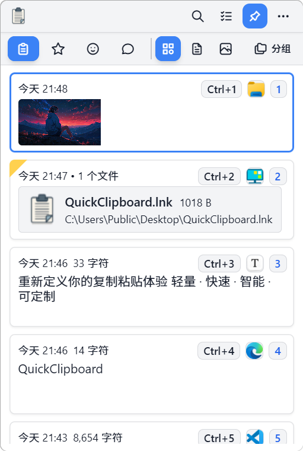
      </a>
      <div><strong>라이트</strong></div>
    </td>
    <td>
      <a href="../readme-assets/display/浅色手绘.png" target="_blank">
        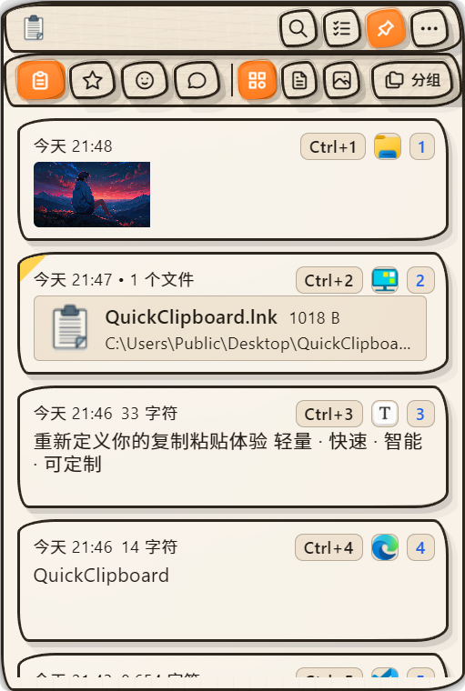
      </a>
      <div><strong>라이트 스케치</strong></div>
    </td>
    <td>
      <a href="../readme-assets/display/暗色.png" target="_blank">
        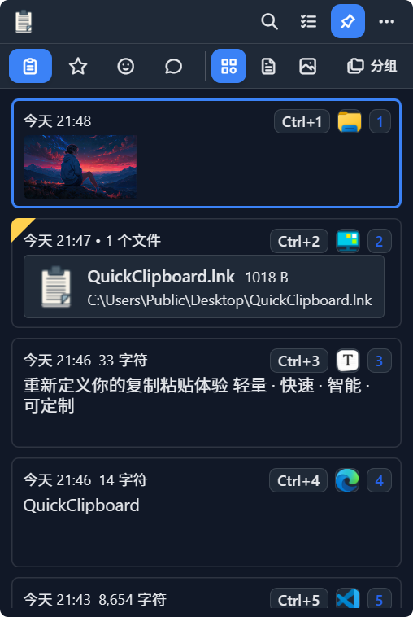
      </a>
      <div><strong>다크</strong></div>
    </td>
    <td>
      <a href="../readme-assets/display/暗色经典.png" target="_blank">
        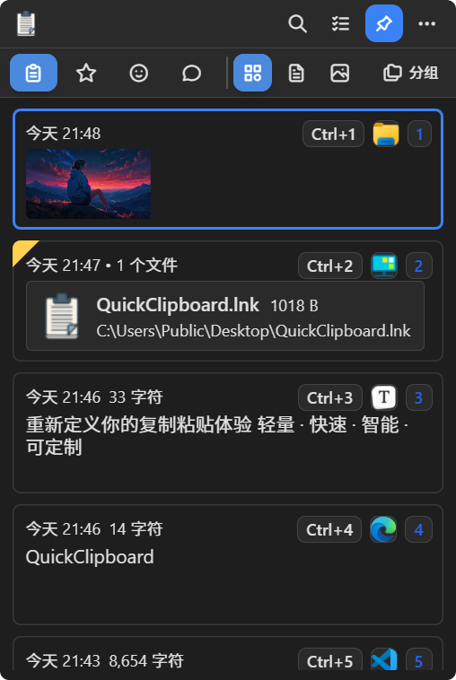
      </a>
      <div><strong>다크 클래식</strong></div>
    </td>
    <td>
      <a href="../readme-assets/display/暗色手绘.png" target="_blank">
        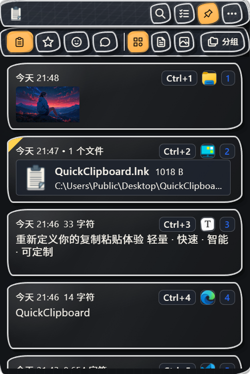
      </a>
      <div><strong>다크 스케치</strong></div>
    </td>
    <td>
      <a href="../readme-assets/display/自定义背景.png" target="_blank">
        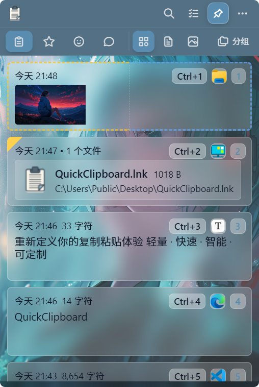
      </a>
      <div><strong>사용자 정의 배경</strong></div>
    </td>
  </tr>
</table>

<table>
  <tr align="center">
    <td>
      <a href="../readme-assets/display/设置.png" target="_blank">
        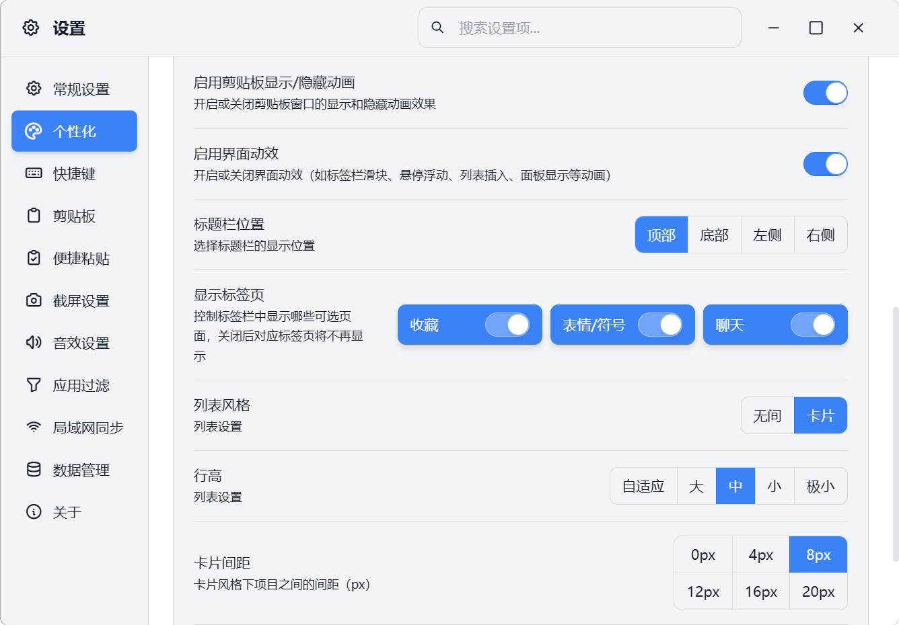
      </a>
      <div><strong>설정</strong></div>
    </td>
    <td>
      <a href="../readme-assets/display/表情符号页.png" target="_blank">
        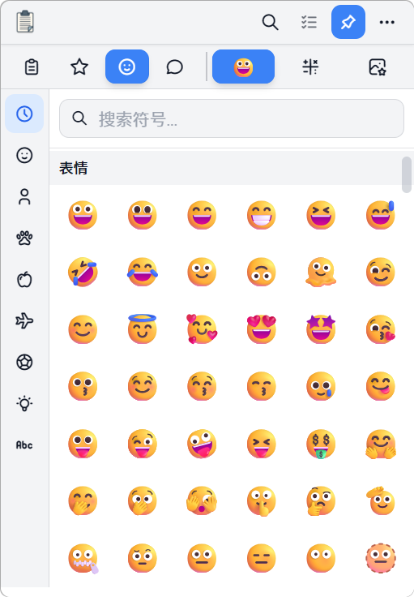
      </a>
      <div><strong>이모지 선택기</strong></div>
    </td>
    <td>
      <a href="../readme-assets/display/图库页.png" target="_blank">
        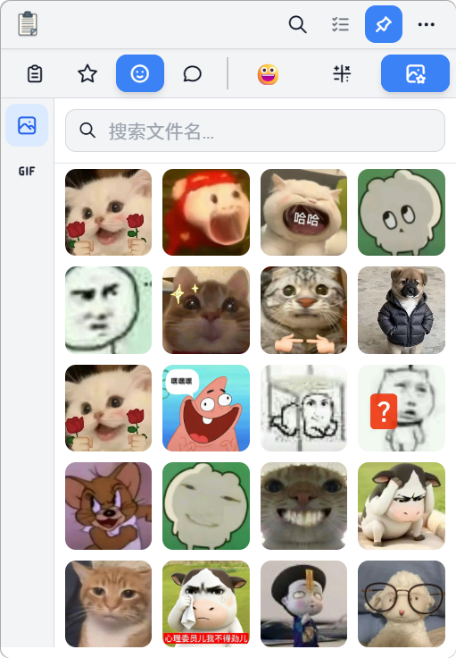
      </a>
      <div><strong>갤러리</strong></div>
    </td>
  </tr>
</table>

<table>
  <tr align="center">
    <td>
      <a href="../readme-assets/display/内容预览.gif" target="_blank">
        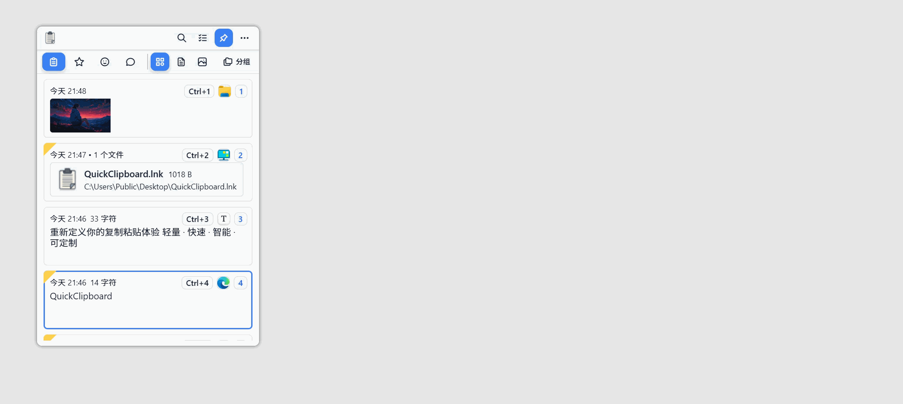
      </a>
      <div><strong>콘텐츠 미리보기</strong></div>
    </td>
  </tr>
</table>

</div>

---

## 시스템 요구사항

- Windows 10 / 11 (x64)

---

## 다운로드 (v0.3.2)

| 유형                                                          |                     설명 |                                                           다운로드 수                                                          | 링크                                                                                                                                                                                                |
| ------------------------------------------------------------- | -----------------------: | :--------------------------------------------------------------------------------------------------------------------------: | --------------------------------------------------------------------------------------------------------------------------------------------------------------------------------------------------- |
| **NSIS 설치 프로그램**<br>`QuickClipboard_0.3.2_x64-setup.exe` | 권장; 자동 제거 지원      |        | [](https://github.com/mosheng1/QuickClipboard/releases/download/v0.3.2/QuickClipboard_0.3.2_x64-setup.exe) |
| **일반 포터블**<br>`QuickClipboard_0.3.2.exe`                  |       설치 불필요, 바로 사용 |                 | [](https://github.com/mosheng1/QuickClipboard/releases/download/v0.3.2/QuickClipboard_0.3.2.exe)    |
| **USB 포터블**<br>`QuickClipboard_0.3.2_portable.exe`          |     USB 및 모바일 사용에 적합 |         | [](https://github.com/mosheng1/QuickClipboard/releases/download/v0.3.2/QuickClipboard_0.3.2_portable.exe) |
| **Android APK**<br>`QuickClipboard_Android_v1.0.3.apk`         |       Android 기기용 |         | [](https://github.com/mosheng1/QuickClipboard/releases/download/v0.3.0/QuickClipboard_Android_v1.0.3.apk) |
| **클라우드 드라이브**                                          |    GitHub 속도가 느릴 때 대체 수단 |                                                          —                                                                    | [](https://www.123912.com/s/A9Ckjv-Vu75v?pwd=UhWA#)                                                |

---

## 공식 웹사이트 · 튜토리얼 · 커뮤니티

<div align="center">

<a href="https://space.bilibili.com/438982697" target="_blank">
  
</a>

<p style="margin-top:6px; margin-bottom:18px;">
  기능 데모, 사용법 튜토리얼, 설치 가이드 및 FAQ 제공
</p>

<a href="https://quickclipboard.cn/" target="_blank">
  
</a>

<p style="margin-top:6px; margin-bottom:24px;">
  최신 버전, 다운로드 미러, 문서 및 더 많은 콘텐츠 확인
</p>

<p style="margin-top:10px; margin-bottom:12px;">
  QR 코드를 스캔하거나 번호를 검색하여 참여하세요:
</p>

<table>
  <tr>
    <td align="center" width="33%">
      <a href="https://pd.qq.com/s/blp3j847c" target="_blank">
        
      </a>
      <div style="margin-top:8px;"><strong>채널:</strong> pd80680380</div>
      <div style="margin-top:10px;">
        <a href="https://pd.qq.com/s/blp3j847c" target="_blank">
          
        </a>
      </div>
    </td>
    <td align="center" width="33%">
      <a href="https://qm.qq.com/q/nUCO76MX9C" target="_blank">
        
      </a>
      <div style="margin-top:8px;"><strong>그룹1:</strong> 725313287</div>
      <div style="margin-top:10px;">
        <a href="https://qm.qq.com/q/nUCO76MX9C" target="_blank">
          
        </a>
      </div>
    </td>
    <td align="center" width="33%">
      <a href="https://qm.qq.com/q/O5zOi3uTuy" target="_blank">
        
      </a>
      <div style="margin-top:8px;"><strong>그룹2:</strong> 1033556729</div>
      <div style="margin-top:10px;">
        <a href="https://qm.qq.com/q/O5zOi3uTuy" target="_blank">
          
        </a>
      </div>
    </td>
  </tr>
</table>

</div>

---

## 지원 및 후원

<div align="center">
  <p>이 프로젝트가 도움이 되셨다면 Star, Fork 또는 기부를 통해 개발을 지원해 주세요.</p>
  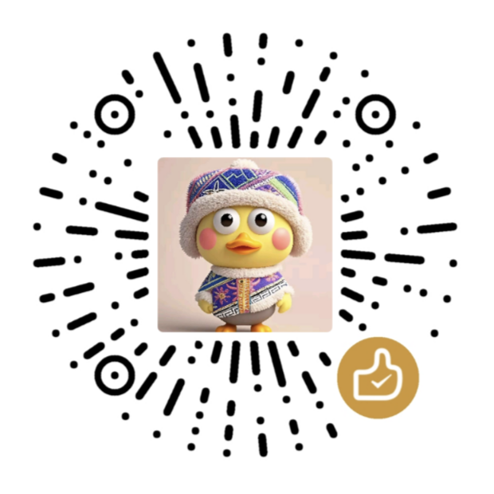
</div>


---

## 개발 및 빌드

### 환경 요구사항

- Node.js ≥ 16  
- Rust ≥ 1.70  
- Tauri CLI ≥ 2.0

### 자주 사용하는 명령어

```bash
# 의존성 설치
npm install

# 개발 모드
npm run tauri dev

# 릴리스 빌드
npm run tauri:build

# 커뮤니티 에디션 개발 모드 (비공개 플러그인 제외)
npm run tauri:dev:community

# 커뮤니티 에디션 빌드 (비공개 플러그인 제외)
npm run tauri:build:community
```

### 비공개 플러그인 정보

본 프로젝트의 **공식 릴리스 버전**에는 다음 비공개 플러그인이 포함되어 있습니다 (오픈소스 범위 제외):

- `gpu-image-viewer` (GPU 가속 이미지 뷰어): 이미지 고정 및 미리보기 성능 향상, 여러 개의 고정 창이 열려 있을 때 메모리 사용량을 크게 절감.
- `screenshot-suite` (스크린샷 제품군): 자유형 스크린샷, 스크린샷 후 고정, 스크린샷 OCR, 스크롤 스크린샷 등 관련 기능 포함.

---

## 라이선스

본 프로젝트는 [Apache License 2.0](LICENSE) 하에 공개되었습니다.

> 비공개 플러그인 `gpu-image-viewer`, `screenshot-suite`는 오픈소스 범위에 포함되지 않으며, 공식 릴리스 버전에만 포함됩니다.
